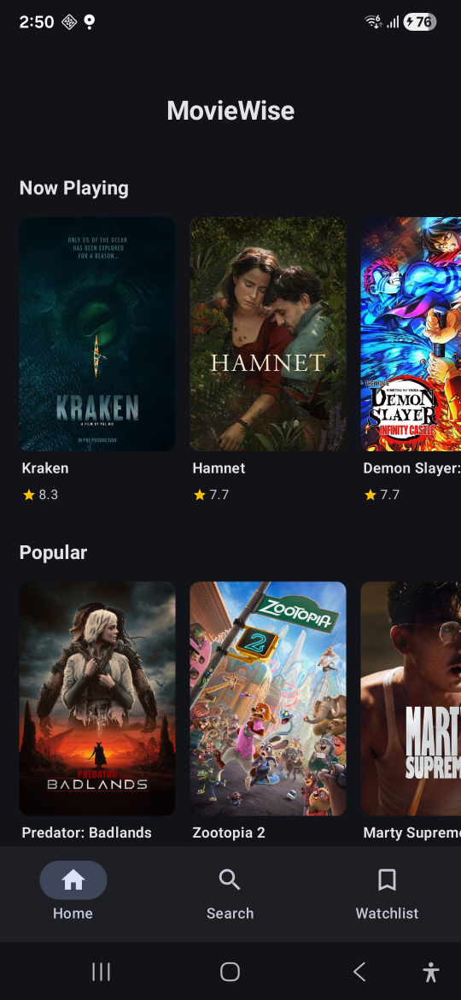
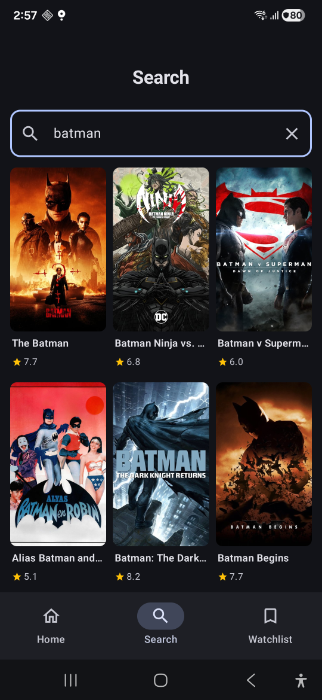
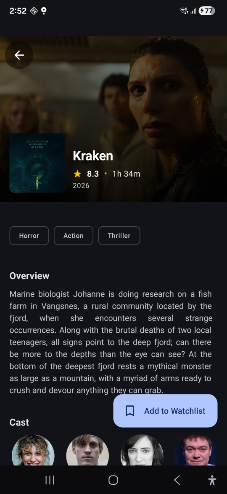
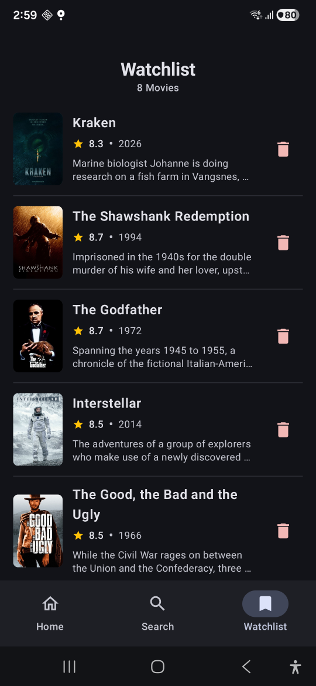

<div align="center">
  
# 🎬 MovieWise

<p align="center">

</p>

[](https://github.com/UsmanAnsari/MovieWise/actions)
[](https://kotlinlang.org)
[](https://developer.android.com)
[](https://developer.android.com/jetpack/compose)
[](https://github.com/UsmanAnsari/MovieWise/actions)


## Modern Android Movie Discovery App

### A production-grade movie discovery application showcasing Clean Architecture, MVI pattern, hybrid caching strategies, and comprehensive testing with CI/CD automation.
*Built as a portfolio project to demonstrate modern Android development practices for mid-level to senior engineering roles.*

</div>

---

## 📱 Features

### Core Functionality
- **🎥 Browse Movies** — Discover Now Playing, Popular, Top Rated, and Upcoming releases
- **💨 Instant Loading** — Home screen loads from cache instantly, updates silently in background
- **🔍 Smart Search** — Debounced search (300ms delay) with infinite scroll pagination
- **📖 Movie Details** — Cast, genres, runtime, ratings, release dates, and full synopsis
- **⭐ Offline Watchlist** — Save and manage bookmarks with zero network dependency
- **🔄 Pull-to-Refresh** — Manual content refresh with Material 3 components

### Technical Highlights
- **🏗️ Clean Architecture** — Strict layer separation with dependency inversion
- **🔄 MVI Pattern** — Unidirectional data flow for predictable state management
- **💾 Hybrid Caching** — NetworkBoundResource for Home, API-first for Detail/Search
- **🗄️ Room Database** — Offline-capable watchlist with reactive Flow updates
- **♾️ Paging 3** — Memory-efficient infinite scroll with built-in load states
- **⚡ Flow Operators** — Debounce, distinctUntilChanged, flatMapLatest for search optimization
- **🧪 50+ Tests** — Comprehensive unit and instrumentation test coverage
- **🚀 CI/CD** — Automated testing and signed release builds via GitHub Actions

---

## 📸 Screenshots

<div align="center">

| Home Screen | Search Results | Movie Detail | Watchlist |
|:-----------:|:--------------:|:------------:|:---------:|
|  |  |  |  |


---
  ## 🎬 [MovieWise DEMO - YouTube](https://youtube.com/shorts/Q-xoPOWvsO0)
  
  | Browse cached home content | Search with debounce | Manage fully-offline watchlist |
  |:-----------:|:-----------:|:-----------:|
  |  |  |  |
  
---
</div>

## 📲 Download & Install

### Option 1: GitHub Actions Artifact (Recommended)
1. Go to [GitHub Actions](https://github.com/UsmanAnsari/MovieWise/actions)
2. Click latest successful workflow run (green ✅)
3. Download `MovieWise-release-vXX` artifact
4. Unzip and install `app-release.apk`

*Signed release build with ProGuard enabled. May require "Install from Unknown Sources".*

### Option 2: Build from Source
See [Getting Started](#-getting-started) section.

---

## 🛠️ Tech Stack

| Category | Technologies | Why This Choice |
|----------|-------------|-----------------|
| **Language** | Kotlin 2.2.1 | Coroutines, Flow, null safety |
| **UI** | Jetpack Compose + Material 3 | Declarative UI, modern design |
| **Architecture** | Clean Architecture + MVI | Testability, separation of concerns |
| **Dependency Injection** | Hilt (Dagger)| Less boilerplate than manual Dagger |
| **Database** | Room | Type-safe SQL, Flow integration |
| **Networking** | Retrofit + Kotlinx Serialization | Standard HTTP client, compile-time safety |
| **Async** | Kotlin Coroutines + Flow | Native async/reactive programming |
| **Pagination** | Paging 3 | Memory-efficient infinite scroll |
| **Image Loading** | Coil | Native Compose integration |
| **Testing** | JUnit, MockK, Turbine | Kotlin-first testing tools |
| **CI/CD** | GitHub Actions | Free for public repos |

---

## 🏗️ Architecture

MovieWise follows **Clean Architecture** with strict layer boundaries and dependency inversion.

### Three-Layer Architecture

```
┌──────────────────────────────────────────────────────────────┐
│                    PRESENTATION LAYER                        │
│  ┌──────────────┐  ┌──────────────┐  ┌───────────────────┐   │
│  │   Compose    │  │  ViewModels  │  │  MVI Contracts    │   │
│  │   Screens    │◄─┤  (State Mgmt)├─►│ State/Event/Effect│   │
│  └──────────────┘  └──────────────┘  └───────────────────┘   │
├──────────────────────────────────────────────────────────────┤
│                       DOMAIN LAYER                           │
│  ┌──────────────┐  ┌──────────────┐  ┌──────────────────┐    │
│  │  Use Cases   │  │    Models    │  │   Repository     │    │
│  │  (Business)  │  │   (Domain)   │  │   Interfaces     │    │ 
│  └──────────────┘  └──────────────┘  └──────────────────┘    │
├──────────────────────────────────────────────────────────────┤
│                        DATA LAYER                            │
│  ┌──────────────┐  ┌──────────────┐  ┌──────────────────┐    │
│  │ Repositories │  │  TMDB API    │  │   Room Database  │    │
│  │    (Impl)    │◄─┤  (Retrofit)  ├─►│  (Cache+Watch)   │    │
│  └──────────────┘  └──────────────┘  └──────────────────┘    │
└──────────────────────────────────────────────────────────────┘
```

### MVI Unidirectional Data Flow
```
┌─────────────────────────────────────────────────────────────┐
│                        MVI PATTERN                          │
├─────────────────────────────────────────────────────────────┤
│                                                             │
│                      ┌──────────────┐                       │
│       ┌─────────────►│   UI/SCREEN  │─────────────┐         │
│       │              │   (Compose)  │             │         │
│       │              └──────────────┘             │         │
│       │                                           │         │
│      STATE                                      EVENT       │
│   (Immutable)                                 (Intent)      │
│       │                                           │         │
│       │              ┌──────────────┐             │         │
│       │              │              │             │         │
│       └──────────────│  VIEWMODEL   │◄────────────┘         │
│                      │   (Process)  │                       │
│                      └──────┬───────┘                       │
│                             │                               │
│                      ┌──────▼───────┐                       │
│                      │   USE CASE   │                       │
│                      │   (Domain)   │                       │
│                      └──────┬───────┘                       │
│                             │                               │
│                      ┌──────▼───────┐                       │
│                      │  REPOSITORY  │                       │
│                      │ (API + Room) │                       │
│                      └──────────────┘                       │
│                                                             │
└─────────────────────────────────────────────────────────────┘
```

### Caching Strategy by Screen

| Screen | Strategy | Rationale | Network Required |
|--------|----------|-----------|------------------|
| **Home** | Cache-first (NetworkBoundResource) | Users revisit frequently; instant UX | ❌ No (shows cache) |
| **Detail** | API-first (no cache) | Details rarely change; always-fresh data | ✅ Yes |
| **Search** | API-only (Paging 3) | Dynamic results; caching queries = storage explosion | ✅ Yes |
| **Watchlist** | Fully offline (Room only) | User's data should be locally owned | ❌ Never |

### NetworkBoundResource Pattern (Home Screen)
```kotlin
Cache-first approach for optimal UX:

1. Query Room database → Emit cached data (instant UI)
2. Fetch from TMDB API in parallel
3. Save fresh data to Room on success
4. Room update triggers new emission → UI updates silently
5. On API failure: Keep showing cache + display error Snackbar

Result: Users never see blank loading screens after first launch.
```
---

## 🗄️ Database Schema

MovieWise uses **Room** with two main entities.

### Entity Relationship Diagram
```
┌─────────────────┐              ┌─────────────────┐
│  MovieEntity    │              │ WatchlistEntity │
│                 │              │                 │
│  • id           │              │  • id           │
│  • title        │              │  • title        │
│  • overview     │              │  • overview     │
│  • posterPath   │              │  • posterPath   │
│  • voteAverage  │              │  • voteAverage  │
│  • releaseDate  │              │  • releaseDate  │
│  • category     │              │  • addedAt      │
│  • cachedAt     │              │                 │
└─────────────────┘              └─────────────────┘
        │                                │
        │                                │
    Caches home                     User bookmarks
   screen movies                    (fully offline)
```

### Database Features

| Feature | Implementation | Purpose |
|---------|---------------|---------|
| **Caching** | `MovieEntity` with `category` field | Instant home screen loading |
| **Offline Watchlist** | `WatchlistEntity` separate table | Zero network dependency |
| **Flow Updates** | Room `@Query` returns `Flow<List<T>>` | Automatic UI updates on data changes |
| **Cache Invalidation** | Delete old + insert fresh in transaction | Atomic cache updates |

---
## 🧪 Testing Strategy

### Test Pyramid: 50+ Tests
```
           ╱╲
          ╱  ╲       8 UI Tests
         ╱────╲      (Navigation integration)
        ╱      ╲
       ╱        ╲    45+ Unit Tests
      ╱──────────╲   (Business logic)
     ╱            ╲
    ╱──────────────╲
```
### Test Coverage Breakdown

| Layer | What's Tested |
|-------|---------------|
| **ViewModels** | State transitions, event handling, effects |
| **Repository**  | NetworkBoundResource, caching, API failures |
| **Mappers**  | DTO/Entity/Domain transformations |
| **UseCases** | Repository delegation, parameter passing |
| **Utilities** | Error message mapping, HTTP codes |
| **Navigation** | Bottom nav, screen transitions, back stack |

---
### CI/CD Testing

Every push triggers:
- ✅ 45+ automated tests on Ubuntu
- ✅ Android Lint checks
- ✅ Signed release APK build
- ✅ Test reports on failure

[View Latest Results →](https://github.com/UsmanAnsari/MovieWise/actions)

---

## 🚀 Getting Started

### Prerequisites

- Android Studio Hedgehog (2023.1.1) or newer
- JDK 17
- Android SDK 26+
- TMDB API key ([Get free key](https://www.themoviedb.org/settings/api))

### Installation

1. **Clone the repository**
```bash
git clone https://github.com/UsmanAnsari/MovieWise.git
cd MovieWise
```

2. **Get TMDB API Key**
   - Sign up at [themoviedb.org](https://www.themoviedb.org/signup)
   - Settings → API → Request API Key → Developer
   - Copy **API Key (v3 auth)** (not Read Access Token)

3. **Create `local.properties`**

In project root:
```properties
TMDB_API_KEY=your_api_key_here
```

*File is git-ignored for security*

4. **Build and Run**
```bash
./gradlew installDebug
# Or click Run ▶️ in Android Studio
```

### Troubleshooting

**API Key Error:**
- Verify `local.properties` in project root (not `app/`)
- File → Sync Project with Gradle Files

**Build Errors:**
```bash
./gradlew clean build
```

---

## 📁 Project Structure
```
app/src/main/java/com/usman/moviewise/
│
├── 📂 data/                           # Data Layer
│   ├── local/
│   │   ├── dao/                       # Room DAOs
│   │   ├── entity/                    # Room Entities
│   │   └── MovieDatabase.kt           # Room Database
│   ├── remote/
│   │   ├── api/                       # Retrofit API interfaces
│   │   └── dto/                       # Network DTOs
│   ├── repository/                    # Repository implementations
│   ├── mappers/                       # Data transformations
│   └── util/                          # NetworkBoundResource
│
├── 📂 domain/                         # Domain Layer
│   ├── model/                         # Domain models
│   ├── repository/                    # Repository interfaces
│   └── usecase/                       # Business logic
│       ├── GetPopularMoviesUseCase.kt
│       ├── GetMovieDetailUseCase.kt
│       ├── SearchMoviesUseCase.kt
│       └── ...
│
├── 📂 ui/                             # Presentation/UI Layer
│   ├── home/                          # Home screen (MVI)
│   │   ├── HomeContract.kt            # State/Event/Effect
│   │   ├── HomeViewModel.kt           # State management
│   │   └── HomeScreen.kt              # Compose UI
│   ├── detail/                        # Detail screen
│   ├── search/                        # Search screen
│   ├── watchlist/                     # Watchlist screen
│   ├── navigation/                    # Nav graph & bottom nav
│   └── components/                    # Shared UI components
│
├── 📂 di/                             # Dependency Injection
│   ├── NetworkModule.kt               # Retrofit, OkHttp
│   ├── DatabaseModule.kt              # Room, DAOs
│   └── RepositoryModule.kt            # Repository bindings
│
└── 📂 util/                           # Utilities
    ├── Constants.kt
    └── Extensions.kt
```
---

## 🎯 Key Implementation Highlights

### 1. MVI Contract Pattern
```kotlin
// HomeContract.kt - Clean separation of concerns

data class State(
    val isLoading: Boolean = true,
    val popular: List = emptyList(),
    val nowPlaying: List = emptyList(),
    val error: String? = null
) : UiState

sealed interface Event : UiEvent {
    data object Refresh : Event
    data class MovieClicked(val movieId: Int) : Event
}

sealed interface Effect : UiEffect {
    data class NavigateToDetail(val movieId: Int) : Effect
}
```

### 2. NetworkBoundResource Implementation
```kotlin
inline fun  networkBoundResource(
    crossinline query: () -> Flow,
    crossinline fetch: suspend () -> RequestType,
    crossinline saveFetchResult: suspend (RequestType) -> Unit,
    crossinline shouldFetch: (ResultType) -> Boolean = { true }
): Flow<Resource> = flow {
    // 1. Emit cached data first (instant UI)
    val data = query().first()
    emit(Resource.Loading(data))

    if (shouldFetch(data)) {
        try {
            // 2. Fetch from API
            val apiResponse = fetch()
            
            // 3. Save to database
            saveFetchResult(apiResponse)
            
            // 4. Query database again (single source of truth)
            emitAll(query().map { Resource.Success(it) })
        } catch (e: Exception) {
            // 5. On error, keep showing cached data
            emit(Resource.Error(e.toUserFriendlyMessage(), data))
        }
    } else {
        // Cache is fresh enough
        emit(Resource.Success(data))
    }
}
```

### 3. Search with Debounce
```kotlin
// SearchViewModel.kt

init {
    queryFlow
        .debounce(300)                      // Wait 300ms after typing stops
        .filter { it.length >= 2 }          // Minimum 2 characters
        .distinctUntilChanged()             // Skip if same as previous
        .flatMapLatest { query ->           // Cancel old search when new query arrives
            searchMovies(query)
                .cachedIn(viewModelScope)   // Preserve data across config changes
        }
        .collectLatest { pagingData ->
            setState { copy(searchResults = pagingData) }
        }
}
```
---

## 📊 Use Cases Overview

MovieWise implements **9 Use Cases** following Single Responsibility Principle:

| Use Case | Responsibility | Returns |
|----------|---------------|---------|
| `GetPopularMoviesUseCase` | Fetch popular movies (cached) | `Flow<Resource<List<Movie>>>` |
| `GetNowPlayingMoviesUseCase` | Fetch now playing (cached) | `Flow<Resource<List<Movie>>>` |
| `GetTopRatedMoviesUseCase` | Fetch top rated (cached) | `Flow<Resource<List<Movie>>>` |
| `GetUpcomingMoviesUseCase` | Fetch upcoming (cached) | `Flow<Resource<List<Movie>>>` |
| `GetMovieDetailUseCase` | Fetch movie details (API-only) | `Flow<Resource<MovieDetail>>` |
| `SearchMoviesUseCase` | Search with Paging 3 | `Flow<PagingData<Movie>>` |
| `GetWatchlistUseCase` | Fetch watchlist (Room) | `Flow<List<Movie>>` |
| `AddToWatchlistUseCase` | Add movie to watchlist | `suspend fun` |
| `RemoveFromWatchlistUseCase` | Remove from watchlist | `suspend fun` |
| `IsMovieInWatchlistUseCase` | Check watchlist status | `Flow<Boolean>` |

---

## 🎓 What I Learned

<details>
<summary><b>Architecture & Design Patterns</b></summary>

**Clean Architecture isn't just folders** — It's about dependency rules. The domain layer has zero Android dependencies, making business logic completely testable.

**MVI eliminates state bugs** — Unidirectional flow means state can only be modified in one place (ViewModel). No more "who changed this state?" debugging sessions.

**NetworkBoundResource is production-critical** — Users on slow networks see cached content instantly. If API fails, they still have a working app. This pattern is essential for mobile.

</details>

<details>
<summary><b>Testing Strategy</b></summary>

**Test the pyramid, not the ice cream cone** — 45+ unit tests (fast, stable) + 8 UI tests (slow, integration-only).

**Turbine makes Flow testing elegant** — `test { awaitItem() }` beats `runBlocking { delay(100) }` every time.

**MockK's coEvery/coVerify** — Perfect for suspend functions. Mockito requires workarounds.

</details>

<details>
<summary><b>Performance & UX</b></summary>

**Debounce saved my API quota** — Typing "inception" without debounce = 9 API calls. With 300ms debounce = 1 call.

**Room Flow is magical** — Add movie to watchlist in DetailScreen → WatchlistScreen updates automatically. Zero manual refresh code.

**flatMapLatest cancels old searches** — User types fast, old search requests are cancelled automatically. No race conditions.

</details>

<details>
<summary><b>CI/CD & DevOps</b></summary>

**GitHub Actions caught bugs I missed locally** — Lint violations, test failures from merge conflicts, build issues from dependency updates.

**Signed APK automation** — Base64-encode keystore → Store in GitHub Secrets → Decode in workflow → Sign APK. Took time to set up, saves hours long-term.

**Branch name sanitization** — `feature/search` → `feature-search` for artifact names. Small detail, avoids workflow failures.

</details>

---

## 🚧 Scope: Portfolio vs Production

### Current Implementation

| Feature | Status | Notes |
|---------|--------|-------|
| **Home Caching** | ✅ Implemented | NetworkBoundResource pattern |
| **Watchlist** | ✅ Fully Offline | Room database with Flow |
| **Search** | ✅ API-only | Paging 3 with debounce |
| **Detail** | ✅ API-first | No caching (deliberate choice) |
| **Testing** | ✅ 50+ tests | Unit + instrumentation |
| **CI/CD** | ✅ Automated | GitHub Actions with signed APKs |

### Production Enhancements

In a production app with millions of users, I would add:

| Enhancement | Why | Complexity |
|-------------|-----|-----------|
| **Detail Caching** | Offline detail viewing | Medium (RemoteMediator) |
| **Cloud Sync** | Cross-device watchlist | High (backend + auth) |
| **Analytics** | Understand user behavior | Low (Firebase) |
| **Crashlytics** | Production error tracking | Low (Firebase) |
| **Accessibility** | TalkBack optimization | Medium (custom semantics) |
| **Localization** | Multi-language support | Medium (TMDB supports 30+) |

**Why these aren't included:** This is a **portfolio project** optimized for demonstrating Clean Architecture, MVI, and testing practices — the core skills employers evaluate. Adding every production feature would dilute focus and increase maintenance burden.

---
## 🗺️ Roadmap

- [x] Phase 1: Foundation (Clean Architecture + MVI)
- [x] Phase 2: Core Features (Browse, Search, Detail, Watchlist)
- [x] Phase 3: Comprehensive Testing (50+ tests)
- [x] Phase 4: CI/CD Pipeline (GitHub Actions)
- [ ] Phase 5: Detail Screen Caching (RemoteMediator)
- [ ] Phase 6: Firebase Integration (Auth + Cloud Sync)
- [ ] Phase 7: Analytics & Crashlytics

---
## 👤 Author

**Usman Ali Ansari**

- 📧 Email: usman10ansari@gmail.com
- 💼 LinkedIn: [usman1ansari](https://www.linkedin.com/in/usman1ansari)
- 🐙 GitHub: [@UsmanAnsari](https://github.com/UsmanAnsari/)

## 🙏 Acknowledgments

- [TMDB](https://www.themoviedb.org/) — Free movie API
- [Material Design 3](https://m3.material.io/) — Design system
- Android Community — Excellent open-source libraries

---

<div align="center">

### ⭐ Star this repo if you find it helpful! ⭐

**Built with ❤️ to demonstrate production-ready Android development**

</div>

